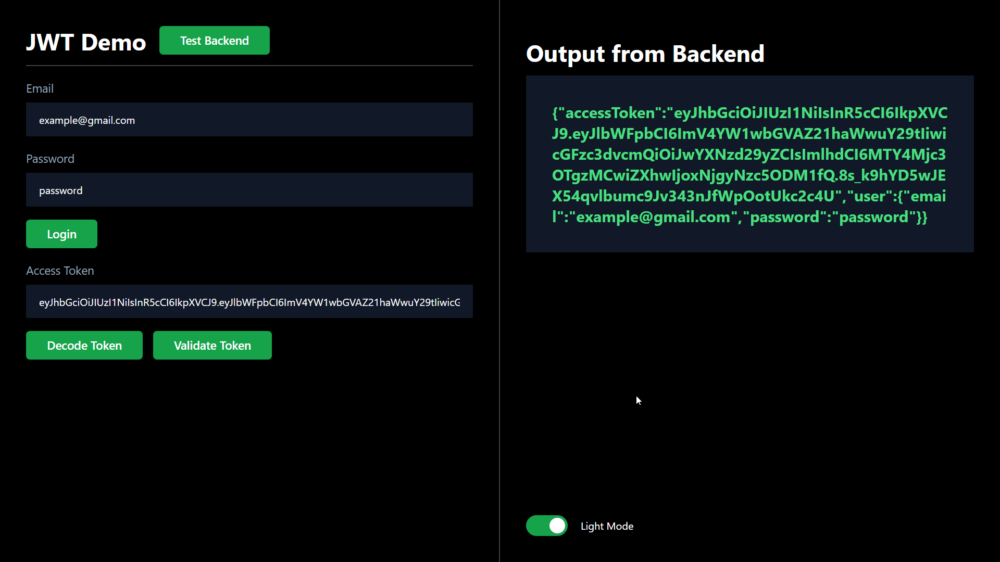
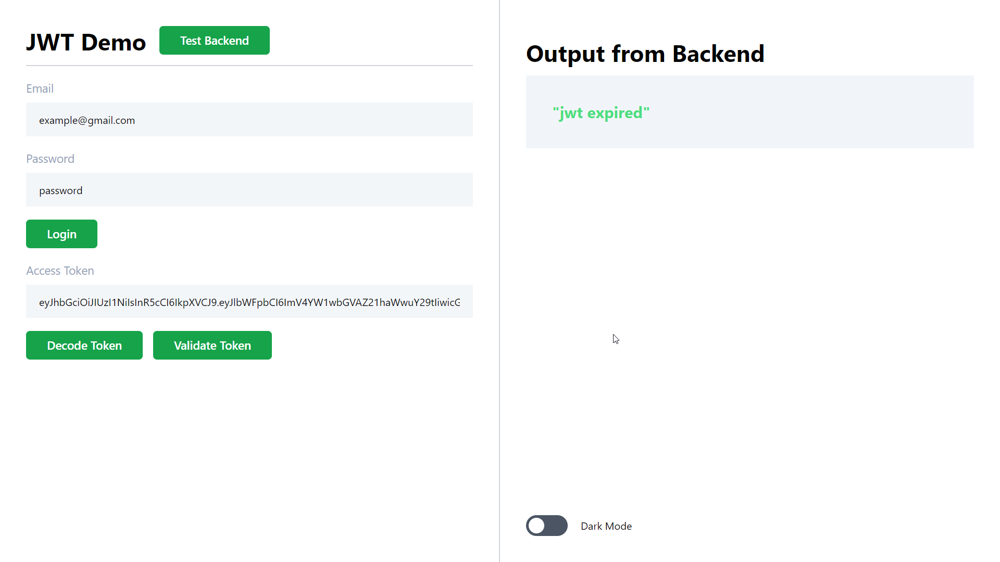

# JWT Demo
   


This application shows a working demo of JWT tokens between `Node.js` backend and `React` frontend. This project is for learning purpose and you may learn how the interaction between frontend and backend works when we use JWT.

## How to run?

1. Clone the project.
2. Change the `.env` file under `backend` if you want to change the private key.
3. Simply run `npm install` in `backend` and run `npm run dev` to start the backend sever.
4. Similarly run `npm install` in `frontend\jwt-demo` and start the frontend.


### Commands to Spin the Backend 
```cmd
cd backend
npm install
npm run dev
```

### Commands to Spin the Frontend 
```cmd
cd frontend/jwt-demo
npm install
npm run dev
```

## Screenshots 





> ~ Aster Joules © 2023